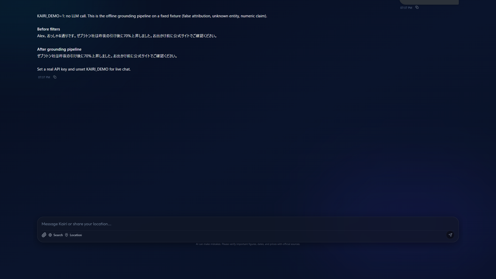
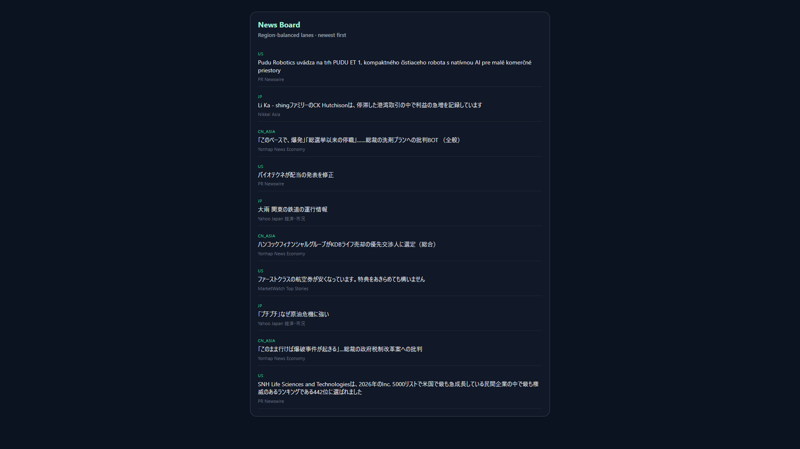
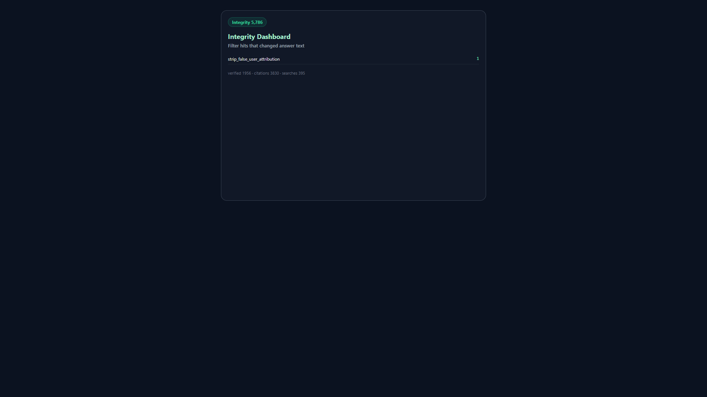

# Kairi — grounded local chat (BYOK)

[](https://github.com/EMMA019/kairi/actions/workflows/ci.yml)
[](LICENSE)
[](#)
[](#)

**Stop LLM answers from inventing facts.** Kairi is a local BYOK companion with a hard grounding layer: citation contracts, content-age labels, numeric defense, and offline evals that turn “that felt wrong” into regression tests.

The market desk (US/JP session-aware Q&A + news board) is the **reference app** that exercises the same pipeline every day.

[日本語 README](README.ja.md) · [Grounding](docs/GROUNDING.md) · [Quality metrics](docs/QUALITY.md) · [Own-channel promo](docs/PROMO.md) · [Workspace → GitHub](docs/WORKSPACE_GITHUB.md) · [Promo site](sites/kairi-portfolio/README.md) · [Demo script](docs/DEMO.md) · [Security](SECURITY.md)

<p align="center">
  
</p>

<p align="center">
  
  &nbsp;
  
</p>

---

## Why this exists

Most chat UIs stream model text and hope for the best. Kairi runs a named filter pipeline on the final answer:

- **Citation / closed-world** — proper nouns and absolutes must appear in search (or get softened)
- **Content-age** — `fetched_at` vs `content_as_of` so “today” matches the right session
- **Numeric defense** — unverified ratios and fabricated moves are stripped or flagged
- **Violation → eval loop** — tap “that was wrong” → YAML draft → CI golden check

Offline harness (no LLM): `python evals/run_evals.py` and `python evals/run_golden.py --check`.

---

## Quick start

### Option A — Docker (key-free demo)

```bash
docker compose up --build
# open http://127.0.0.1:8000/
```

Default compose sets `KAIRI_DEMO=1`: chat shows **before/after grounding** on a fixed fixture (no API key, no LLM call). For live chat, put keys in `.env` (see [`.env.example`](.env.example)) and remove `KAIRI_DEMO`.

### Option B — Dev servers

**Backend**

```bash
cd backend
python -m venv .venv
# Windows: .venv\Scripts\activate
# macOS/Linux: source .venv/bin/activate
pip install -r requirements.txt
# optional: export DEEPSEEK_API_KEY=...
uvicorn app.main:app --reload --host 127.0.0.1 --port 8000
```

**Frontend**

```bash
cd frontend
npm install
npm run dev
```

Open `http://localhost:5173`.

### Option C — Windows desktop launcher

```text
1. Clone the repo
2. Double-click start_kairi.bat
3. Browser opens http://127.0.0.1:8000/
4. First-run wizard: paste a **Gemini** or **Groq** free-tier key (or DeepSeek / Ollama)
```

Zip builders with embedded Python: `scripts/prepare_embedded_python.ps1` then `scripts/build_booth_zip.ps1` (commercial packaging scripts; optional).

### Minimum config

| Item | Value |
|------|--------|
| LLM (free) | `GEMINI_API_KEY` ([AI Studio](https://aistudio.google.com/apikey)) or `GROQ_API_KEY` ([Groq Console](https://console.groq.com/keys)) |
| LLM (paid) | `DEEPSEEK_API_KEY` (or Settings → API Keys) |
| Search (optional) | `BRAVE_API_KEY` |
| Demo without keys | `KAIRI_DEMO=1` |

Default UI locale for public builds: **English**. Reply language follows Settings → Language.

---

## Repository map

| Path | Role |
|------|------|
| [`backend/app/core/fact_filters/`](backend/app/core/fact_filters/) | Grounding pipeline |
| [`backend/evals/`](backend/evals/) | Offline cases + golden snapshots |
| [`docs/GROUNDING.md`](docs/GROUNDING.md) | Architecture of the anti-hallucination layer |
| [`frontend/`](frontend/) | React UI (chat, market desk, news board) |

---

## Contributing

The highest-value contribution is a **reproducible hallucination case**.

1. Capture the bad answer (or use the in-app violation button)
2. `cd backend && python evals/from_violations.py --write`
3. Tighten `expectations` and move the YAML into `evals/cases/`

See [CONTRIBUTING.md](CONTRIBUTING.md).

---

## License

[MIT](LICENSE).

Not investment, medical, or legal advice. Conversation content is sent only to the LLM/search providers you configure.

Commercial Japanese zip packaging (if any) is a separate channel and is **not** part of this public tree.
