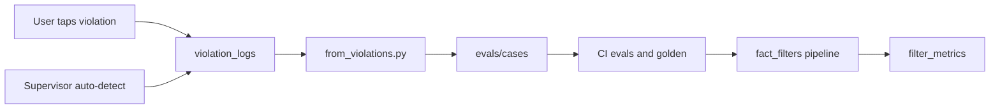

# Grounding layer

Kairi’s differentiator is not “another chat UI.” It is a **post-generation filter stack** plus an **eval loop** that turns user discomfort into CI.

## Pipeline

Final assistant text passes through `apply_grounding_pipeline` in [`backend/app/core/fact_filters/pipeline.py`](../backend/app/core/fact_filters/pipeline.py). Supervisor-side `filter_fact` keeps only light hygiene; the heavy pass runs once at finalize.

Major modules:

| Module | Job |
|--------|-----|
| `citation.py` | Closed-world / citation contract |
| `financial.py` | Quotes, session labels, earnings timing |
| `temporal.py` | Relative dates, weekdays, holidays |
| `entity.py` | Leadership claims, unknown entities |
| `safety.py` | Numeric defense, tool-dump scrub |
| `format.py` | Truncation, false attribution, omakase hygiene |
| `currency.py` | FX consistency |
| `filter_metrics.py` | Which filters actually changed text |

## Contracts worth knowing

1. **Citation** — If the source blob does not support a proper noun or absolute number, soften or strip.
2. **Content-age** — Distinguish when data was fetched from what trading session the figure belongs to (`fetched_at` vs `content_as_of`).
3. **Vacuous completion gate** — “Done” is not enough if acceptance criteria never verified.
4. **UI caution** — A single general “AI can make mistakes” footer; domain-guessed disclaimers are not appended to the body.

## Cheap-model harness

The same pipeline is used to **raise cheap models** without swapping in a frontier LLM. Code lives in [`backend/app/core/harness/`](../backend/app/core/harness/).

1. **Verify loop (coding)** — After a `.py`/`.ts`/… write in task/coding mode, the loop refuses “done” until `pytest` / `npm test` / `go test` actually ran. Failures are fed back; missing tests get a banner, not a fake completion.
2. **Citation-first (chat)** — Numbered search hits are distilled into a quote list *before* generation. The executor may only assert those quotes.
3. **Grounding retry (hard chat)** — If filters had to gut the draft (length drop or ≥2 uncited assertions), one rewrite is sampled and `filter_metrics` / retention pick the better grounded candidate. Override sample count with `KAIRI_BEST_OF_N`.

This is not “the model is Fable.” It is “verified tasks get a Fable-shaped loop.”

## Violation → eval loop



Commands (from `backend/`):

```bash
python evals/from_violations.py --write   # drafts/
python evals/run_evals.py                 # property checks
python evals/run_golden.py --check        # snapshot regression
```

## What the evals are (and are not)

- **Are:** Deterministic, mock-executor offline tests. Fast. Safe for CI.
- **Are not:** Full live LLM judgment. `run_golden.py --live` is opt-in scaffolding only (`KAIRI_LIVE_EVALS=1`).

When writing about Kairi publicly, keep that distinction — overclaiming is the fastest way to lose trust.
